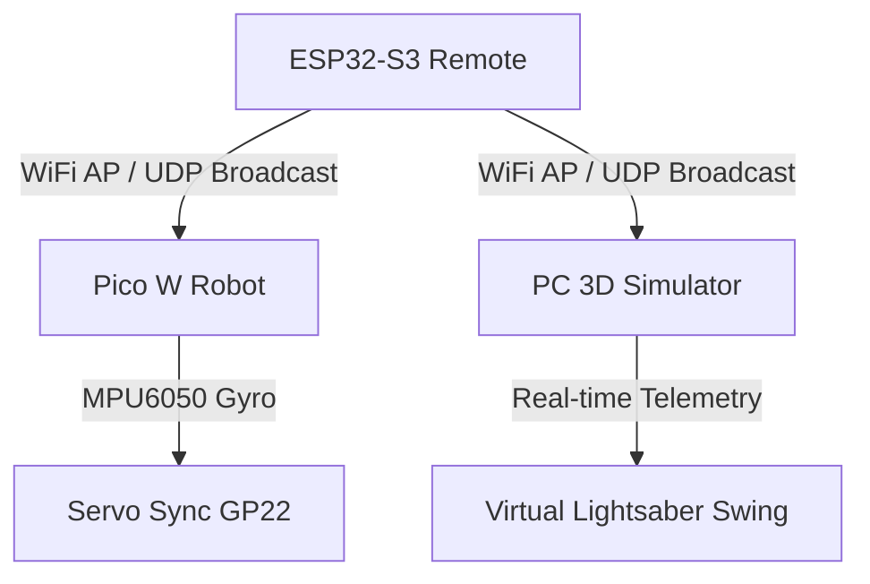

# Ultimate Destroyer Doombot Edgelord Shadow Slayer


A state-of-the-art robotic control project featuring a physical robot (Pico W), a dedicated remote controller (ESP32-S3), and a real-time 3D Digital Twin (Ursina Engine).


## 🚀 Features

- **Real-time Synchronization**: Synchronize physical motion with a high-fidelity 3D simulation.
- **Micro-Servo Calibration**: High-speed PWM (GP22) sync with MPU6050 pitch data (0.01ms updates).
- **UDP Broadcast**: Low-latency control signals (1234 port) and telemetry (1235 port) via WiFi.
- **Digital Twin**: 3D visualization using the Ursina Engine with lightsaber swing physics and SFX.
- **ESP32-S3 AP**: Dedicated WiFi Access Point (AP) for direct robot-to-PC communication.

---

## 🏗️ System Architecture



---

## 🛠️ Components

### 1. ESP32-S3 Remote Controller
Located in `esp32s3_ap_remote_controller_V2/`.
- **Function**: Acts as the Master AP and Broadcast unit.
- **Hardware**: ESP32-S3, BMI160 IMU, Joystick.
- **IP Config**: `192.168.4.1` (Gateway).

### 2. Pico W Robot
Main Logic: `Balancer_with_Servo.py` (Synced version).
- **Function**: Receives UDP broadcasts and drives a servo based on gyro pitch.
- **Hardware**: Raspberry Pi Pico W, MPU6050, 9g Servo (GP22).
- **Static IP**: `192.168.4.10`.

### 3. 3D Digital Twin
Main Logic: `simulator_3d.py`.
- **Function**: Ursina-based vizualization of the robot's state and swing action.
- **Features**: Dynamic lighting, collision detection, and audio feedback.

---

## ⚙️ Setup & Installation

### Robot (Pico W)
1. Install MicroPython on Pico W.
2. Upload `mpu6050.py`, `config.py` and `Balancer_with_Servo.py`.
3. Connect the MPU6050 to I2C0 (SDA=4, SCL=5) and Servo to GP22.

### PC Simulator
1. Create a Python environment:
   ```bash
   conda create -n simple-ss python=3.10
   conda activate simple-ss
   pip install ursina
   ```
2. Connect PC WiFi to `RobotAP` (Password: `robot12345`).
3. Run: `python simulator_3d.py`.

---

## 🕹️ Control Protocol

Commands are sent via UDP Broadcast to port `1234` in ASCII format:
`speed, turn, q0, q1, q2, q3, gx, gy, gz`

- **speed/turn**: Analog joystick values.
- **q0-q3**: Quaternion orientation from remote.
- **gx-gz**: Raw gyro data for swing detection.

---

## 📝 License
This project is for research and educational purposes only.

---
*Created by Zhen Li, Eli Zamora, Winston Le*

